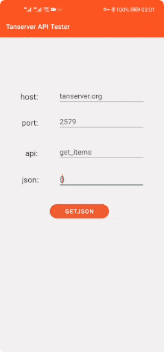

<div align=center>
    
</div>

<div align=center>
    
    
    
</div>

# Tanserver

Tanserver is a free and open source server framework built for APIs.
It allows you to write server-side APIs (in Python or C++) that will be used from the client, so you can handle a stable and secure client-server comunication.

Tanserver use a custom protocol that increase server performance and supports integration with [PostgreSQL](https://www.postgresql.org/).

You can apply Tanserver to your `Android` / `iOS` / `desktop` / `web` apps.

## Documentation

* [Install Tanserver](https://tanserver.org/en/install/)
* [Tanserver documentation](https://www.tanserver.org)

## Features

- **Security** ：Encrypted based on SSL protocol.

- **Hot reload** ：Help you quickly add APIs or fix bugs.

- **Log shipping** ：Support log shipping.

## Connector

You need a connector to connect your client app to tanserver, currently `Java`, `Javascript` and `Swift` clients are supported. (`Dart` / `C++` will be supported in the future.)

1. [Java](https://github.com/tansrv/tanserver-connectors/tree/main/java)

2. [Swift](https://github.com/tansrv/tanserver-connectors/tree/main/swift)

3. [Javascript](https://github.com/tansrv/tanserver-connectors/tree/main/javascript)

## Example

API: `get_items`

Convert items table data into JSON string and send it to the client.

`items`
| id   | name     | price |
| ---- | ----     | ----  |
| 0    | book     | 5     |
| 1    | keyboard | 200   |

```cpp
string
get_items(const Json::Value &value_recvd)
{
    try {
        string  json_string = pg_query("8.8.8.8", /* Your PostgreSQL server IP address  */
                                       "select array_to_json(array_agg(row_to_json(items))) from items;",
                                       NULL);

        json_append_status(json_string, 0, "OK");
        return json_string;
    } catch (...) {
        throw "error";
    }
}
```

When the client calls `getJSON("get_items", "{}")`:



---

Copyright (C) tanserver.org
