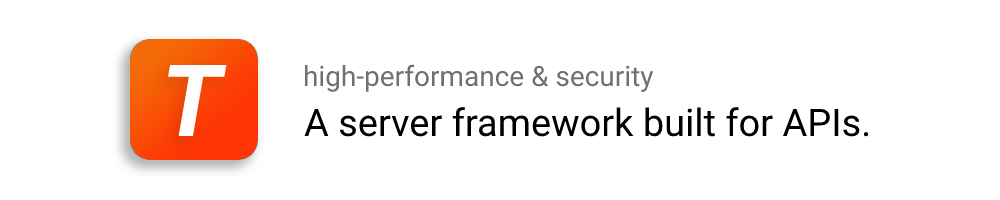

# 

 [](https://tanserver.org) 

Tanserver is a high performance Linux server framework that allows you to easily and efficiently develop server APIs in python for `Android` / `iOS` / `desktop` / `web` apps.  
With this framework you can build a stable, secure and customizable client-server communication and also manage data thanks to [PostgreSQL](https://www.postgresql.org/) integration.

- [Documentation](#documentation)
- [How it works](#how-it-works)
- [Features](#features)
- [Client connectors](#client-connectors)
- [API example](#api-example)

## Documentation

* [Install Tanserver](https://tanserver.org/en/install/)
* [Tanserver documentation](https://www.tanserver.org)

## How it works
Tanserver receives requests as JSON string from the client using a custom protocol that improves response time.  
JSON string is composed by an header that contains API name and a body that contains parameters passed to API.
After completing the computation and eventually querying the database, Tanserver sends a response to the client as JSON data.

## Features

- **Security** : Encrypted based on SSL / TLS protocol. The security is the same as HTTPS.

- **Hot reload** : Even in a production environment, users can add APIs or fix bugs in existing APIs.

- **Log shipping** : Built-in log shipping server, which allows users to download log files from multiple servers in real time.

## Client connectors

You need a connector to connect your client app to tanserver, currently `Java`, `Javascript` and `Swift` clients are supported. (`Dart` / `C++` will be supported soon.)

- [Java](https://github.com/tansrv/tanserver-connectors/tree/main/java)

- [Swift](https://github.com/tansrv/tanserver-connectors/tree/main/swift)

- [Javascript](https://github.com/tansrv/tanserver-connectors/tree/main/javascript)

## API example

API: `get_items`

Convert items table data into JSON string and send it to the client.

`items`
| id   | name     | price |
| ---- | ----     | ----  |
| 0    | book     | 5     |
| 1    | keyboard | 200   |

```python
from tanserver import *

def get_items(json_obj):
    try:
        res = pg_query('127.0.0.1', # Your PostgreSQL server IP address
                       'select array_to_json(array_agg(row_to_json(items))) from items')

        return json_append_status(res, 0, 'OK')
    except:
        return 'Query failed'
```

When the client calls `getJSON("get_items", "{}")`:


**You can find more examples here: https://tanserver.org/en/examples/**
